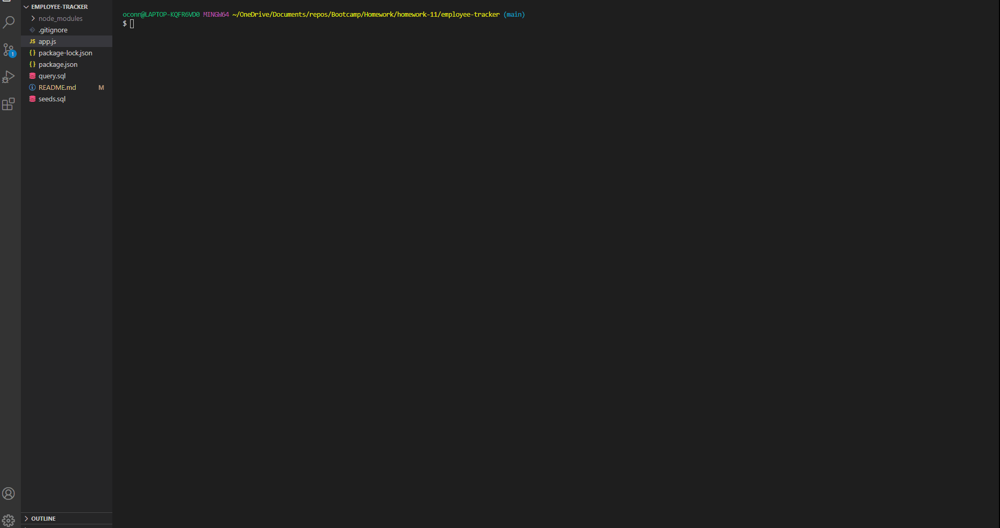

# employee-tracker

## Description

    A node applciation that uses the command line and MySQL to create an employee database.  This allows the user to view all emplyees, deparments and employee roles and add to them. Also allows the user to update the roles of a given employee.

## Insallation

    In the command line run either node app.js or npm start, to begin the application.

## Technologies 
    * JavaScript
    * NodeJs
    * Inquirer
    * MySQL
